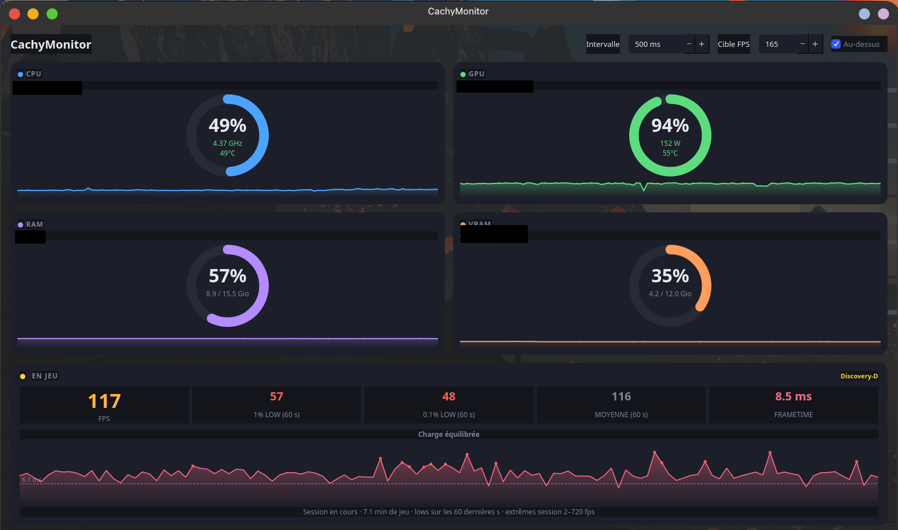
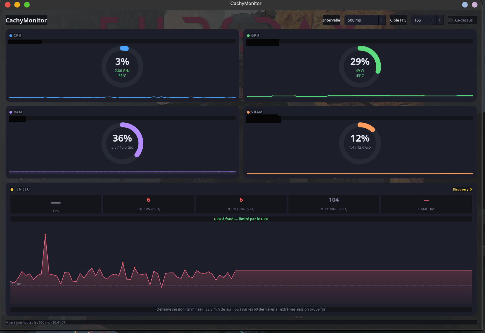

# CachyMonitor

Moniteur système léger pour CachyOS : **CPU, GPU, RAM, VRAM, températures et FPS**, avec graphes temps réel. Un seul fichier Python, une seule dépendance (PySide6).



*En jeu : FPS, 1 % low, frametime et goulot d'étranglement CPU/GPU en temps réel.*



*Hors jeu : vue d'ensemble des composants (CPU, GPU, RAM, VRAM) avec températures et courbes de tendance.*

## Pourquoi CachyMonitor ?

Je suis un gamer et j'aime jouer à plusieurs jeux sur CachyOS. Je cherchais une application capable de monitorer mon matériel et de me donner un maximum d'informations sur le comportement de mes composants pendant le jeu — mais je n'ai trouvé aucun moniteur système pensé spécialement pour les jeux. J'ai donc décidé de créer le mien.

Comme je n'ai aucune formation de développeur, j'ai sollicité l'aide de mon ami IA, Claude, qui m'a énormément aidé. Le résultat a été tellement bluffant que j'ai eu envie de partager cette application avec toute personne qui souhaite l'essayer.

## Installation de la dépendance

```sh
sudo pacman -S pyside6
```

(Tout le reste — `nvidia-smi`, `sensors`, `mangohud` — est déjà présent sur ta machine.)

## Lancer

```sh
python3 ~/cachymonitor/cachymonitor.py
```

Pour l'avoir dans le menu KDE :

```sh
cp ~/cachymonitor/cachymonitor.desktop ~/.local/share/applications/
```

## Sources des données

| Métrique      | Source                                            |
|---------------|---------------------------------------------------|
| CPU usage/cœur| `/proc/stat`                                      |
| CPU fréquence | `/sys/.../cpufreq/scaling_cur_freq`               |
| CPU temp      | hwmon `k10temp` (Tctl)                             |
| RAM           | `/proc/meminfo`                                   |
| GPU / VRAM    | `nvidia-smi` (usage, temp, clock, power)          |
| FPS           | dernier log CSV de **MangoHud**                   |

## Activer le FPS (MangoHud)

Le FPS provient des logs MangoHud. Le plus simple : logging automatique.
Ajoute à `~/.config/MangoHud/MangoHud.conf` :

```ini
output_folder=/home/younescachy/.local/share/MangoHud/logs
autostart_log=1
log_interval=100
```

Puis lance un jeu avec MangoHud :

- **Steam** → propriétés du jeu → options de lancement : `mangohud %command%`
- **En direct** : `mangohud <jeu>`

Dès qu'un jeu tourne et écrit un log, CachyMonitor affiche le FPS automatiquement
(et repasse à « — » quelques secondes après la fermeture du jeu).

> Les dossiers cherchés sont configurables en haut du script (`FPS_LOG_DIRS`).

## Compatibilité matérielle

CachyMonitor vise **tout matériel sous Linux**, mais tout n'est pas vérifié.

| | CPU | GPU |
|---|---|---|
| **AMD** | ✅ testé (`k10temp`) | ⚠️ écrit, non testé (`amdgpu` via `/sys`) |
| **Intel** | ⚠️ écrit, non testé (`coretemp`) | ⚠️ partiel, non testé (`i915`/`xe`) |
| **NVIDIA** | — | ✅ testé (`nvidia-smi`) |

**Seule configuration réellement vérifiée** : AMD Ryzen 5 5600 + NVIDIA RTX 3060,
sous CachyOS / KDE Plasma / Wayland.

Le reste est écrit d'après la documentation du noyau, sans matériel sous la main
pour l'exécuter. L'application ne plantera pas si un capteur manque : la valeur
concernée affiche simplement `—`.

À noter pour les GPU Intel : le taux d'occupation n'est pas exposé dans `/sys`
et demande `intel_gpu_top` avec les droits root. Seuls le nom, la température et
la fréquence sont donc lus. La VRAM est de la mémoire partagée, sans compteur
dédié.

### J'ai besoin de vous 🙏

J'ai créé CachyMonitor seul, et je n'ai **qu'une seule machine** pour le tester
(AMD Ryzen 5 5600 + NVIDIA RTX 3060). Autrement dit : **je n'ai aucune idée de la
façon dont l'application se comporte sur un autre matériel que le mien.**

Un Radeon, un CPU Intel, un GPU intégré… chaque configuration est différente, et
sans vous, ces cas resteront des angles morts. C'est vraiment là que j'ai besoin
de la communauté : **votre commentaire est le seul moyen de savoir comment l'app
réagit sur votre matériel**, et donc de l'améliorer pour tout le monde.

Pas besoin d'être développeur, ni de lancer quoi que ce soit. Un simple mot —
« chez moi tout marche » ou « la température GPU affiche `—` » — m'aide déjà
énormément. Racontez-moi votre config et ce que vous voyez, ça compte pour moi 🙂

**➡️ [Laisser un commentaire (Discussions)](https://github.com/YOUNES-2-wq/cachymonitor/discussions)**

<details>
<summary>💡 Optionnel : joindre un rapport matériel détaillé</summary>

Si vous voulez m'aider davantage, un petit script génère un rapport de vos
capteurs. Il est **en lecture seule**, ne demande **jamais** les droits root et
n'affiche **aucune** donnée personnelle — vous pouvez l'ouvrir et le lire avant
de le lancer :

```bash
cat scripts/hw-report.sh   # pour l'inspecter d'abord, en toute confiance
./scripts/hw-report.sh     # puis le lancer si vous le souhaitez
```

Collez sa sortie dans un commentaire ou une
[issue](https://github.com/YOUNES-2-wq/cachymonitor/issues).
</details>

## Licence

[MIT](LICENSE) — tu peux utiliser, modifier et redistribuer ce code
librement, à condition de conserver la mention de copyright.
