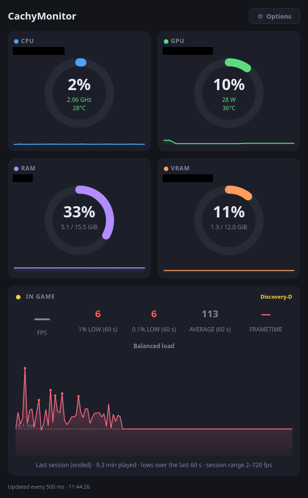
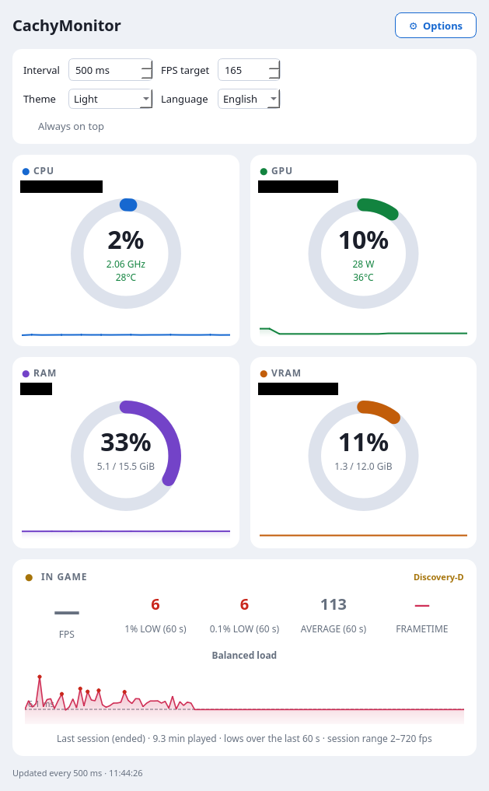

# CachyMonitor

Moniteur système léger pour CachyOS : **CPU, GPU, RAM, VRAM, températures et FPS**, avec graphes temps réel. Un seul fichier Python, une seule dépendance (PySide6).

> ℹ️ Projet communautaire indépendant, créé par un utilisateur de CachyOS. **Non affilié à l'équipe officielle de CachyOS** — le nom traduit simplement l'affection pour la distribution.



*Jauges CPU / GPU / RAM / VRAM avec températures et courbes de tendance, et en bas les statistiques de session : FPS, 1 % low, 0.1 % low, frametime et goulot d'étranglement CPU/GPU.*



*Thème clair, panneau Options ouvert : intervalle de rafraîchissement, cible FPS, thème (clair / sombre / système) et affichage au-dessus des autres fenêtres.*

## Pourquoi CachyMonitor ?

Je suis un gamer et j'aime jouer à plusieurs jeux sur CachyOS. Je cherchais une application capable de monitorer mon matériel et de me donner un maximum d'informations sur le comportement de mes composants pendant le jeu — mais je n'ai trouvé aucun moniteur système pensé spécialement pour les jeux. J'ai donc décidé de créer le mien.

Comme je n'ai aucune formation de développeur, j'ai sollicité l'aide de mon ami IA, Claude, qui m'a énormément aidé. Le résultat a été tellement bluffant que j'ai eu envie de partager cette application avec toute personne qui souhaite l'essayer.

## Une première du genre 🚀

CachyMonitor s'appuie sur **[MangoHud](https://github.com/flightlessmango/MangoHud)**,
l'outil de référence qui enregistre les performances en jeu sous Linux. Mais là où
MangoHud affiche un **overlay par-dessus le jeu**, CachyMonitor va plus loin : il
**transforme ces logs en véritables statistiques de session**, dans une fenêtre à part.

À ma connaissance, c'est **la première application de ce genre** — une fenêtre
compagnon, distincte du jeu, qui réunit dans une seule interface visuelle :

- les **statistiques de session calculées** — 1 % low, 0,1 % low, moyenne, pics de
  frametime (micro-saccades) et **goulot d'étranglement CPU vs GPU** ;
- les **jauges de composants en direct** — CPU, GPU, RAM, VRAM, fréquences,
  consommation et températures, avec courbes de tendance ;
- le tout **sans overlay** qui s'affiche par-dessus le jeu, dans une appli légère
  (un seul fichier Python, une seule dépendance) ;
- en **thème clair ou sombre**, au choix ou en suivant automatiquement le bureau.

Les briques existaient déjà (MangoHud, Goverlay…), mais personne ne les avait
assemblées en un **tableau de bord compagnon pensé pour le jeu**. C'est toute
l'idée de CachyMonitor : ne pas réinventer la mesure, mais la rendre **lisible et
analysable**. 🙏 Merci à l'équipe de MangoHud, sans qui rien de tout ça ne serait possible.

## Installation

> **CachyMonitor fonctionne sur n'importe quelle distribution Linux** (Arch,
> CachyOS, Fedora, Ubuntu, Debian, openSUSE, Pop!\_OS…). Il ne lit que des sources
> standard du noyau (`/proc`, `/sys`, `hwmon`), `nvidia-smi` et les logs MangoHud :
> rien n'est spécifique à une distribution. La seule différence entre distros, c'est
> la manière d'installer la dépendance (**PySide6**).
>
> - **Distros basées sur Arch** (CachyOS, Manjaro, EndeavourOS…) → installation en une
>   commande via l'**AUR** (ci-dessous).
> - **Toutes les autres distros** → installation manuelle depuis Git (section plus bas).

### Depuis l'AUR (recommandé, distros Arch)

[](https://aur.archlinux.org/packages/cachymonitor)

Sur CachyOS / Arch, avec un assistant AUR — par exemple `paru` :

```sh
paru -S cachymonitor
```

ou `yay` :

```sh
yay -S cachymonitor
```

Puis lance **CachyMonitor** depuis ton menu d'applications, ou la commande `cachymonitor`.

### Manuellement, sur n'importe quelle distribution

Fonctionne partout : il suffit de **Python 3** (déjà présent sur toute distro) et de
**PySide6**.

**1. Installe PySide6** avec le gestionnaire de paquets de ta distro :

```sh
# Arch / CachyOS / Manjaro
sudo pacman -S pyside6

# Fedora
sudo dnf install python3-pyside6

# Ubuntu / Debian / Pop!_OS / Mint
sudo apt install python3-pyside6

# openSUSE
sudo zypper install python3-PySide6
```

> Si PySide6 n'est pas packagé sur ta distro, tu peux toujours l'installer avec pip
> (idéalement dans un environnement virtuel) : `pip install PySide6`.

**2. Clone le dépôt :**

```sh
git clone https://github.com/YOUNES-2-wq/cachymonitor.git
```

**3. Lance l'application :**

```sh
python3 cachymonitor/cachymonitor.py
```

> Optionnel selon ton matériel : `mangohud` (statistiques en jeu), `nvidia-utils`
> (GPU NVIDIA), `pciutils` (nom du GPU), `dmidecode` (type/vitesse RAM). Chacun de ces
> paquets s'installe de la même façon selon ta distro (`dnf`, `apt`, `zypper`…).

## Sources des données

| Métrique      | Source                                            |
|---------------|---------------------------------------------------|
| CPU usage/cœur| `/proc/stat`                                      |
| CPU fréquence | `/sys/.../cpufreq/scaling_cur_freq`               |
| CPU temp      | hwmon `k10temp` (Tctl)                             |
| RAM           | `/proc/meminfo`                                   |
| GPU / VRAM    | `nvidia-smi` (usage, temp, clock, power)          |
| FPS           | dernier log CSV de **MangoHud**                   |

## Activer le FPS (MangoHud)

Le FPS provient des logs MangoHud. Le plus simple : logging automatique.
Ajoute à `~/.config/MangoHud/MangoHud.conf` :

```ini
output_folder=~/.local/share/MangoHud/logs
autostart_log=1
log_interval=100
```

Puis lance un jeu avec MangoHud :

- **Steam** → propriétés du jeu → options de lancement : `mangohud %command%`
- **En direct** : `mangohud <jeu>`

Dès qu'un jeu tourne et écrit un log, CachyMonitor affiche le FPS automatiquement
(et repasse à « — » quelques secondes après la fermeture du jeu).

> Les dossiers cherchés sont configurables en haut du script (`FPS_LOG_DIRS`).

## Compatibilité matérielle

CachyMonitor vise **tout matériel sous Linux**, mais tout n'est pas vérifié.

| | CPU | GPU |
|---|---|---|
| **AMD** | ✅ testé (`k10temp`) | ⚠️ écrit, non testé (`amdgpu` via `/sys`) |
| **Intel** | ⚠️ écrit, non testé (`coretemp`) | ⚠️ partiel, non testé (`i915`/`xe`) |
| **NVIDIA** | — | ✅ testé (`nvidia-smi`) |

**Seule configuration réellement vérifiée** : AMD Ryzen 5 5600 + NVIDIA RTX 3060,
sous CachyOS / KDE Plasma / Wayland.

Le reste est écrit d'après la documentation du noyau, sans matériel sous la main
pour l'exécuter. L'application ne plantera pas si un capteur manque : la valeur
concernée affiche simplement `—`.

À noter pour les GPU Intel : le taux d'occupation n'est pas exposé dans `/sys`
et demande `intel_gpu_top` avec les droits root. Seuls le nom, la température et
la fréquence sont donc lus. La VRAM est de la mémoire partagée, sans compteur
dédié.

### J'ai besoin de vous 🙏

J'ai créé CachyMonitor seul, et je n'ai **qu'une seule machine** pour le tester
(AMD Ryzen 5 5600 + NVIDIA RTX 3060). Autrement dit : **je n'ai aucune idée de la
façon dont l'application se comporte sur un autre matériel que le mien.**

Un Radeon, un CPU Intel, un GPU intégré… chaque configuration est différente, et
sans vous, ces cas resteront des angles morts. C'est vraiment là que j'ai besoin
de la communauté : **votre commentaire est le seul moyen de savoir comment l'app
réagit sur votre matériel**, et donc de l'améliorer pour tout le monde.

Pas besoin d'être développeur, ni de lancer quoi que ce soit. Un simple mot —
« chez moi tout marche » ou « la température GPU affiche `—` » — m'aide déjà
énormément. Racontez-moi votre config et ce que vous voyez, ça compte pour moi 🙂

**➡️ [Laisser un commentaire (Discussions)](https://github.com/YOUNES-2-wq/cachymonitor/discussions)**

<details>
<summary>💡 Optionnel : joindre un rapport matériel détaillé</summary>

Si vous voulez m'aider davantage, un petit script génère un rapport de vos
capteurs. Il est **en lecture seule**, ne demande **jamais** les droits root et
n'affiche **aucune** donnée personnelle — vous pouvez l'ouvrir et le lire avant
de le lancer :

```bash
cat scripts/hw-report.sh   # pour l'inspecter d'abord, en toute confiance
./scripts/hw-report.sh     # puis le lancer si vous le souhaitez
```

Collez sa sortie dans un commentaire ou une
[issue](https://github.com/YOUNES-2-wq/cachymonitor/issues).
</details>

## Licence

[MIT](LICENSE) — tu peux utiliser, modifier et redistribuer ce code
librement, à condition de conserver la mention de copyright.
