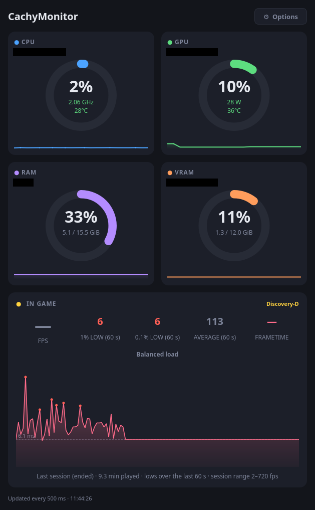
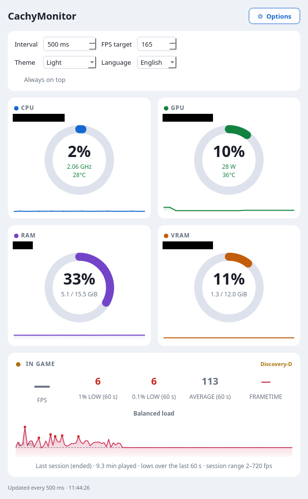
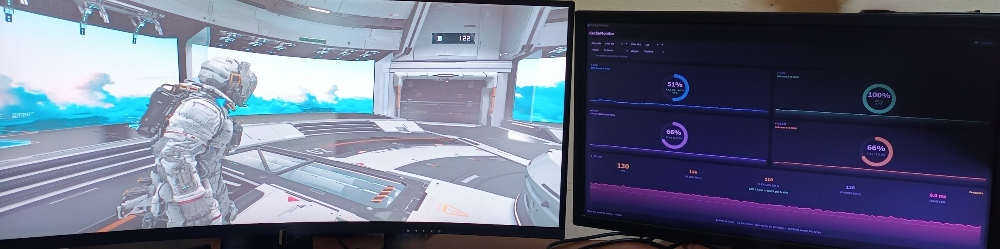

# CachyMonitor

**English** | [Français](README.fr.md)

A lightweight gaming system monitor for a second screen: **CPU, GPU, RAM, VRAM,
temperatures and FPS** with real-time graphs, session statistics (1% low, 0.1% low,
frametime, CPU/GPU bottleneck) and your **controller's battery level**. One Python file
that runs on **Linux and Windows 11**, with a single dependency (PySide6).

```powershell
winget install cachymonitor          # Windows 11
```

```sh
paru -S cachymonitor                 # Arch, CachyOS, Manjaro...
```

Or **[download the Windows installer (CachyMonitor-Setup.exe)](https://github.com/YOUNES-2-wq/cachymonitor/releases/latest)**.
Other Linux distributions: see [manual install](#manual-install-any-distribution).

> Independent community project, made by a CachyOS user. **Not affiliated with the
> official CachyOS team**; the name is just a nod to the distribution.



*CPU / GPU / RAM / VRAM gauges with temperatures and trend graphs. At the bottom, the
session statistics: FPS, 1% low, 0.1% low, frametime and CPU/GPU bottleneck.*



*Light theme with the Options panel open: refresh interval, FPS target, theme (light /
dark / system), language and always-on-top.*



**The perfect app for my second screen.**

> **Language**: the interface follows the system language by default (`LANG`/`LC_ALL`
> on Linux, the Windows locale otherwise): **French** if your desktop is in French,
> **English** everywhere else. You can also switch it live in **Options > Language**
> (System / English / Français); the choice is remembered. Adding a language means
> adding an entry to the `TRANSLATIONS` dictionary at the top of `cachymonitor.py`.
> Contributions are welcome.

## Why CachyMonitor?

I'm a gamer and I play a lot of games on CachyOS. I wanted an app that could monitor my
hardware and tell me as much as possible about how my components behave while I play,
but I couldn't find a system monitor designed specifically for gaming. So I decided to
make my own.

**I'm not a developer.** I built CachyMonitor with a lot of help from an AI assistant,
Claude. I'm saying this upfront because I think you should know. The result surprised me
so much that I wanted to share it with anyone who'd like to try it. The whole program is
a single readable Python file, so anyone can check what it does.

## What it does

On Linux, CachyMonitor builds on **[MangoHud](https://github.com/flightlessmango/MangoHud)**,
the reference tool for recording in-game performance. But where MangoHud shows an
**overlay on top of the game**, CachyMonitor **turns its logs into real session
statistics** in a separate window. On Windows, the same statistics come from
**RivaTuner (RTSS)**.

It is a companion window, separate from the game, that brings together in one interface:

- **computed session statistics**: 1% low, 0.1% low, average, frametime spikes
  (micro-stutters) and a **CPU vs GPU bottleneck** indicator;
- **live component gauges**: CPU, GPU, RAM, VRAM, clock speeds, power draw and
  temperatures, with trend graphs;
- **no overlay** drawn on top of the game, in a light app (one Python file, one
  dependency);
- your **controller**: model, wired or Bluetooth connection and battery level, so it
  doesn't die on you mid-game, **on Linux and on Windows**;
- a **light or dark theme**, chosen by you or following your desktop automatically.

The building blocks already existed (MangoHud, GOverlay, RivaTuner...), but as far as I
know nobody had put them together into a **companion dashboard built for gaming**. That's
the whole idea: not reinventing the measurements, but making them **readable and easy to
analyse**. Many thanks to the MangoHud team, without whom none of this would be possible.

## Install on Windows 11

### With winget (recommended)

CachyMonitor is published in the official catalogue of **winget**, the package manager
built into Windows 11. Open a terminal (PowerShell or Command Prompt) and type:

```powershell
winget install cachymonitor
```

To update later:

```powershell
winget upgrade cachymonitor
```

### With the installer

**[Download CachyMonitor-Setup.exe](https://github.com/YOUNES-2-wq/cachymonitor/releases/latest)**
and double-click it. The setup wizard lets you install for all users or just for you,
creates shortcuts (desktop and Start menu) and uninstalls cleanly from
*Settings > Apps*. **Python is not needed**: everything is bundled.

> **Windows may show a blue "Windows protected your PC" warning.** This is expected and
> it is not a virus: the installer isn't digitally signed, because a code-signing
> certificate costs several hundred euros a year, which is a lot for a free project.
> Click **More info**, then **Run anyway**. This warning depends on the file's
> reputation with Microsoft: it mostly shows up on recent downloads and fades over
> time. The source code is fully readable here, and you can rebuild the installer
> yourself (see below).

### Requirements: MSI Afterburner and RivaTuner

**Read this before wondering why some values are empty.** On Windows, CachyMonitor
doesn't measure the hardware itself: Windows doesn't expose sensors the way the Linux
kernel does (where everything can be read from `/sys`). So the app relies on
**MSI Afterburner**, which most PC gamers already run.

| To get | You need |
|---|---|
| CPU temperature, power draw and real clock speed | **[MSI Afterburner](https://www.msi.com/Landing/afterburner)** (free) |
| FPS and session statistics (1% low, 0.1% low...) | **RivaTuner (RTSS)**, installed automatically with Afterburner |
| CPU usage, RAM, processor name | nothing, works everywhere |
| GPU, VRAM, GPU temperature | nothing on NVIDIA (`nvidia-smi`); Afterburner otherwise |

**What to do:** install Afterburner and leave it running (it starts RTSS by itself).
That's it. There's nothing to configure in CachyMonitor.

**Without Afterburner**, the app still starts and stays usable: CPU, RAM, GPU and VRAM
usage are shown normally. However, temperature, power draw and FPS stay at `—`. There
is a fallback for the temperature only, through
[LibreHardwareMonitor](https://github.com/LibreHardwareMonitor/LibreHardwareMonitor).

> The numbers come **from the same source as the RivaTuner on-screen display**: the FPS
> shown by CachyMonitor is exactly the one you see in game.

### Rebuild the installer yourself

```powershell
python -m pip install pyinstaller pyside6 psutil
winget install JRSoftware.InnoSetup
powershell -ExecutionPolicy Bypass -File packaging\windows\build.ps1
```

The result appears in `dist\`.

### Run without installing (from source)

```powershell
python -m pip install pyside6 psutil
python cachymonitor.py
```

## Install on Linux

> **CachyMonitor works on any Linux distribution** (Arch, CachyOS, Fedora, Ubuntu,
> Debian, openSUSE, Pop!\_OS...). It only reads standard kernel sources (`/proc`,
> `/sys`, `hwmon`), `nvidia-smi` and MangoHud logs: nothing is distribution-specific.
> The only difference between distros is how you install the dependency (**PySide6**).
>
> - **Arch-based distros** (CachyOS, Manjaro, EndeavourOS...): one-command install from
>   the **AUR** (below).
> - **All other distros**: manual install from Git (further down).
>
> **X11 and Wayland**: no data goes through the display server, and Qt6 handles both.
> Tested on both. One thing to know: the "always on top" option is always honoured on
> X11, while many Wayland compositors ignore that request from an application. That's
> not a CachyMonitor bug.

### From the AUR (recommended on Arch-based distros)

[](https://aur.archlinux.org/packages/cachymonitor)

With an AUR helper, for example `paru`:

```sh
paru -S cachymonitor
```

or `yay`:

```sh
yay -S cachymonitor
```

Then launch **CachyMonitor** from your application menu, or run `cachymonitor`.

### Manual install (any distribution)

Works everywhere: all you need is **Python 3** (already present on every distro) and
**PySide6**.

**1. Install PySide6** with your distro's package manager:

```sh
# Arch / CachyOS / Manjaro
sudo pacman -S pyside6

# Fedora
sudo dnf install python3-pyside6

# Ubuntu / Debian / Pop!_OS / Mint
# Debian splits PySide6 into one package per Qt module: there is no global
# "python3-pyside6" package. CachyMonitor only needs these three.
sudo apt install python3-pyside6.qtcore python3-pyside6.qtgui python3-pyside6.qtwidgets

# openSUSE
sudo zypper install python3-PySide6
```

> If PySide6 isn't packaged on your distro, you can still install it with pip
> (ideally in a virtual environment): `pip install PySide6`.

**2. Clone the repository:**

```sh
git clone https://github.com/YOUNES-2-wq/cachymonitor.git
```

**3. Run the app:**

```sh
python3 cachymonitor/cachymonitor.py
```

**4. (Optional) Add CachyMonitor to your application menu**, from the folder where you
cloned the repository. The bundled launcher targets a system-wide (AUR) install; this
command makes a copy that points to your clone.

```sh
mkdir -p ~/.local/share/applications && sed -e "s|^Exec=.*|Exec=python3 $PWD/cachymonitor/cachymonitor.py|" -e "s|^Icon=.*|Icon=$PWD/cachymonitor/cachymonitor.svg|" cachymonitor/cachymonitor.desktop > ~/.local/share/applications/cachymonitor.desktop
```

> Optional, depending on your hardware: `mangohud` (in-game statistics), `nvidia-utils`
> (NVIDIA GPU), `pciutils` (GPU name), `dmidecode` (RAM type/speed). Each one installs
> the same way on your distro (`dnf`, `apt`, `zypper`...).

## Data sources

One file, two sets of sources: `IS_WINDOWS` switches each reader, and everything else
(interface, themes, languages, statistics) is shared.

| Metric          | Linux                                 | Windows 11                                    |
|-----------------|---------------------------------------|-----------------------------------------------|
| CPU usage/core  | `/proc/stat`                          | psutil                                        |
| CPU clock       | `scaling_cur_freq`                    | MSI Afterburner *(real clock, with boost)*    |
| CPU temperature | hwmon `k10temp` / `coretemp`          | Afterburner, then LibreHardwareMonitor        |
| CPU power       | —                                     | Afterburner                                   |
| RAM             | `/proc/meminfo` + `dmidecode`         | psutil + `Win32_PhysicalMemory`               |
| GPU / VRAM      | `nvidia-smi`, `amdgpu`, `i915`        | `nvidia-smi`, then Afterburner sensors        |
| FPS / session   | **MangoHud** CSV logs                 | **RivaTuner (RTSS)**, sampled every 100 ms    |
| Controllers     | `/sys/class/input` + `power_supply`   | raw HID *(Sony)*, XInput *(Xbox)*             |

> Why 100 ms on Windows: the "lows" need a lot of data points. At one sample per second,
> the 0.1% low would be computed from 60 values per minute and would be meaningless. So
> RTSS is sampled at the same rate as MangoHud's `log_interval`.

## Enable FPS on Linux (MangoHud)

> On Windows there's nothing to configure: **RivaTuner (RTSS)** just needs to be running,
> which is the case as soon as MSI Afterburner is started.

FPS comes from MangoHud's **CSV logs**, not from the on-screen overlay: having the
MangoHud HUD visible in game **is not enough**, MangoHud must also *record* a log (which
it doesn't do by default).

**The easy way**: if CachyMonitor finds no log, it shows a message and an **"Enable
MangoHud logging"** button. One click (after confirmation) adds the right lines to your
config, with a backup (`MangoHud.conf.cachymonitor.bak`). Then restart the game.

**By hand**: add this to `~/.config/MangoHud/MangoHud.conf`:

```ini
output_folder=~/.local/share/MangoHud/logs
autostart_log=1
log_interval=100
log_duration=86400
```

> `log_duration`: without it, recording stops after 30 seconds and the FPS disappears.
> You can also start recording on the fly with the `toggle_logging` key (Left Shift + F2
> by default with GOverlay).

Then launch a game with MangoHud:

- **Steam**: game properties > launch options: `mangohud %command%`
- **Directly**: `mangohud <game>`

As soon as a game is running and writing a log, CachyMonitor shows the FPS automatically
(and goes back to `—` a few seconds after the game closes).

> The folders it searches can be changed at the top of the script (`FPS_LOG_DIRS`).

## Hardware compatibility

CachyMonitor aims to support **any hardware**, but not everything has been verified.

**Linux**

| | CPU | GPU |
|---|---|---|
| **AMD** | Tested (`k10temp`) | Written, untested (`amdgpu` via `/sys`) |
| **Intel** | Written, untested (`coretemp`) | Partial, untested (`i915`/`xe`) |
| **NVIDIA** | — | Tested (`nvidia-smi`) |

**Windows 11**

| | CPU | GPU |
|---|---|---|
| **AMD** | Tested (via Afterburner) | Written, untested (Afterburner sensors) |
| **Intel** | Written, untested (via Afterburner) | Written, untested (Afterburner sensors) |
| **NVIDIA** | — | Tested (`nvidia-smi`) |

On Windows, CPU usage, RAM and the processor name don't depend on any particular
hardware and work everywhere. On the other hand, on a non-NVIDIA card the Afterburner
fallback shows the card under the generic name "GPU" and leaves the VRAM gauge at 0%,
because Afterburner doesn't publish total VRAM.

**Controllers, Linux**: tested with a **DualSense (PS5) over Bluetooth**. Xbox
controllers (`xpad` / `xpadneo` drivers), Switch Pro and DualShock 4 use the same kernel
files and should work, but haven't been tried. A controller whose driver doesn't publish
its battery still shows up, with `—` instead of a percentage.

**Controllers, Windows**: tested with a **DualSense (PS5)**, over Bluetooth **and** USB-C.
These are two quite different cases, since Windows doesn't give the same way to read the
controller in each. DualShock 4 support is written from the documentation but
**untested**. **Xbox** controllers go through XInput, which publishes neither the model
nor a percentage, only four battery levels: written, untested (no Xbox controller at hand).

> If a Sony controller is translated into an Xbox controller by **Steam** or
> **DS4Windows**, it may appear twice in the card: there's no way to link the virtual
> controller to the real one, and hiding a duplicate could hide a genuine second
> controller.

**Actually verified setups**: AMD Ryzen 5 5600 + NVIDIA RTX 3060, on
CachyOS / KDE Plasma / Wayland **and** on Windows 11 Pro 24H2 with MSI Afterburner and
RivaTuner (RTSS 7.x).

Everything else is written from the kernel documentation, without hardware at hand to
run it. The app won't crash if a sensor is missing: that value just shows `—`.

Note for Intel GPUs: utilisation isn't exposed in `/sys` and requires `intel_gpu_top`
with root rights. So only the name, temperature and clock speed are read. VRAM is shared
memory, with no dedicated counter.

### I need your help

I made CachyMonitor on my own, and I have **only one machine** to test it on (AMD
Ryzen 5 5600 + NVIDIA RTX 3060). In other words: **I have no idea how the app behaves
on any hardware other than mine.**

A Radeon, an Intel CPU, an integrated GPU... every setup is different, and without you
those cases stay blind spots. **This is even more true for the new Windows 11 version**,
which has only ever run on one machine. Your feedback is the only way for me to know how
the app reacts on your hardware, and so to improve it for everyone.

> **On Windows**, two diagnostic scripts are included in `scripts/`:
> `test_afterburner.py` lists every sensor Afterburner publishes on your machine, and
> `test_rtss.py` inspects RivaTuner's shared memory. If a value stays empty for you,
> their output will tell me why much better than a screenshot.

You don't need to be a developer or run anything. A simple message such as "everything
works for me" or "the GPU temperature shows `—`" already helps a lot. Tell me your setup
and what you see. It really matters to me.

**[Leave a comment (Discussions)](https://github.com/YOUNES-2-wq/cachymonitor/discussions)**

<details>
<summary>Optional: attach a detailed hardware report (Linux)</summary>

If you'd like to help further, a small script generates a report of your sensors. It is
**read-only**, **never** asks for root rights and shows **no** personal data. You can
open and read it before running it:

```bash
cat scripts/hw-report.sh   # inspect it first
./scripts/hw-report.sh     # then run it if you want
```

Paste its output in a comment or an
[issue](https://github.com/YOUNES-2-wq/cachymonitor/issues).
</details>

## License

[MIT](LICENSE): you can use, modify and redistribute this code freely, as long as you
keep the copyright notice.
